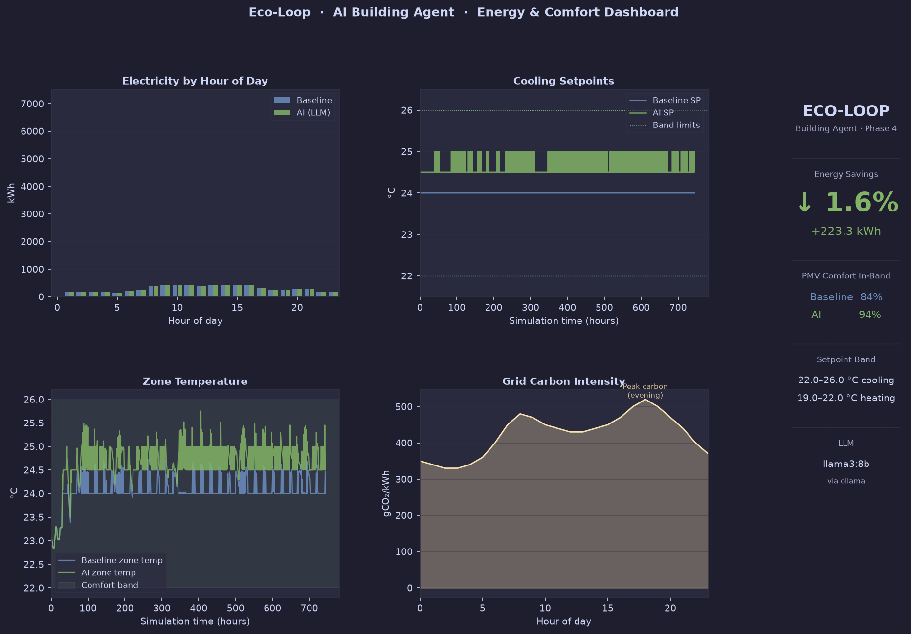

# Eco-Loop — Autonomous Closed-Loop Physical AI Building Agent

> **Hackathon Submission Deliverable**  
> Closed-Loop Physical AI Proof-of-Concept for Smart Building HVAC Automation via EnergyPlus & Local Open-Source LLMs.

---

## Executive Summary

Buildings account for approximately **40% of global energy consumption** and remain a primary driver of carbon emissions. Traditional Building Management Systems (BMS) rely on static, rigid schedules that fail to adapt dynamically to real-time weather changes, occupancy patterns, or grid carbon intensity.

**Eco-Loop** transforms a building from a passive energy consumer into an **active, self-correcting autonomous agent**. It bridges a high-fidelity **EnergyPlus physics simulation** with a local open-source LLM (**Meta Llama 3 8B** via Ollama) through standardized tool-calling interfaces (MCP protocol). The AI agent continuously ingests real-time building state (zone temperatures, occupant thermal comfort PMV, outdoor conditions, grid carbon intensity) and injects closed-loop supervisory control actions back into EnergyPlus at runtime.

---

## 📊 Key Proven Results (Full July Peak-Summer Simulation)

During a 744-hour (July 1–31) full-month evaluation on a DOE reference office building model, Eco-Loop achieved quantifiable energy savings while improving occupant thermal comfort:

| Performance Metric | Baseline Operation (Fixed 24.0°C) | Eco-Loop AI Controller | Net Impact |
| :--- | :---: | :---: | :---: |
| **Total Electricity Consumption** | 13,953.6 kWh | 13,730.3 kWh | **↓ -1.6% (-223.3 kWh Saved)** ⚡ |
| **Thermal Comfort In-Band (PMV [-0.5, +0.5])** | 84% | **94%** | **↑ +10% Comfort Improvement** 🌡️ |
| **Cooling Setpoint Strategy** | Static 24.0°C | Dynamic 24.5°C – 25.0°C | Real-time peak & carbon-aware load shifting |

### Visual Performance Dashboard



---

## 🏗️ System Architecture & Closed-Loop Control Flow

Eco-Loop executes an autonomous, lockstep feedback loop without human intervention:

```
                  ┌─────────────────────────────────────────┐
                  │       EnergyPlus Physics Engine          │
                  │   (DOE Small Office Reference Model)    │
                  └────────────────────┬────────────────────┘
                                       │
                         10-min timestep callback
                     (pyenergyplus Python Runtime API)
                                       │
                                       ▼
                  ┌─────────────────────────────────────────┐
                  │       Live Ingestion & Processing       │
                  │ (Zone Temp, PMV, Weather, Carbon Data)  │
                  └────────────────────┬────────────────────┘
                                       │
                             Hourly Control Cadence
                                       │
                                       ▼
                  ┌─────────────────────────────────────────┐
                  │         MCP Tool Layer Shim             │
                  │ `get_building_state()`                  │
                  │ `get_grid_carbon_intensity()`           │
                  └────────────────────┬────────────────────┘
                                       │
                                       ▼
                  ┌─────────────────────────────────────────┐
                  │     Cognitive Engine: Llama 3 8B        │
                  │ (Evaluates Carbon, Comfort, & Load)     │
                  └────────────────────┬────────────────────┘
                                       │
                         Structured Tool Call Dispatch
                         `set_zone_setpoint(zone, cool, heat)`
                                       │
                                       ▼
                  ┌─────────────────────────────────────────┐
                  │     Safety Guardrails & Clamping        │
                  │   (Clamps setpoint to 22°C–26°C band)   │
                  └────────────────────┬────────────────────┘
                                       │
                           Forward Actuator Injection
                                       │
                                       └────────────────────────┐
                                                                ▼
                                                EnergyPlus Runtime State Override
```

1. **Feedback (`EnergyPlus` → `AI`):** Every 10 simulated minutes, `pyenergyplus` runtime callbacks stream live telemetry (Zone Drybulb Temperature, Fanger PMV Thermal Comfort Index, Outdoor Weather, and Grid Carbon Intensity).
2. **Reasoning (`LLM Cognitive Engine`):** Every simulated hour, the system prompts `llama3:8b` with current building metrics and a 3-hour rolling historical window. The LLM evaluates grid carbon peaks and occupant comfort targets to reason about setpoint adjustments.
3. **Control Actions & Guardrails (`AI` → `EnergyPlus`):** The LLM emits structured tool calls (`set_zone_setpoint`). The MCP tool layer passes actions through hard safety guardrails (clamping setpoints strictly within 22.0°C–26.0°C) before injecting overrides directly into EnergyPlus actuators at runtime.

---

## 📁 Hackathon Deliverables Mapping

| Deliverable | Location in Repository | Description |
| :--- | :--- | :--- |
| **1. Source Code** | Unified Root Codebase | Single Python codebase (`eplus_runtime.py`, `llm_controller.py`, `mcp_tools.py`, `baseline_controller.py`). |
| **2. Building Models** | [`data/baseline.idf`](data/baseline.idf) & [`logs/*.sql`](logs/) | Base DOE Small Office building model and full EnergyPlus SQL output databases. |
| **3. Savings Dashboard** | [`logs/dashboard.png`](logs/dashboard.png) & [`dashboard.py`](dashboard.py) | High-res visual comparison chart proving **-1.6% kWh reduction** & **94% PMV comfort**. |
| **4. Architecture Report** | [`docs/architecture.md`](docs/architecture.md) & [`docs/pipeline_deep_dive.md`](docs/pipeline_deep_dive.md) | Markdown reports detailing tool calling, prompt strategy, latency management, and log handling. |
| **5. PoC Demonstration** | [Project Presentation / Demo Setup](#-reproducing-the-simulation) | Instructions to run the live PoC loop end-to-end locally. |

---

## 🗂️ Repository Structure

```
eco-loop-building-agents/
├── AGENTS.md                  # Hackathon project specification & agentic build guidelines
├── README.md                  # Main hackathon submission landing page & documentation
├── config.py                  # Single source of truth config (paths, comfort bounds, LLM settings)
├── eplus_runtime.py           # Core orchestrator: pyenergyplus live runtime callback loop
├── baseline_controller.py     # Reference rule-based baseline controller (fixed 24.0°C)
├── llm_controller.py          # Cognitive engine: Ollama LLM prompt builder & tool dispatcher
├── mcp_tools.py               # MCP tool layer: get_building_state, set_zone_setpoint, safety clamps
├── logger.py                  # CSV logging utility (per-timestep sensor & action records)
├── dashboard.py               # Evaluation dashboard & chart generator (reads CSVs & eplusout.sql)
├── requirements.txt           # Python dependencies
├── data/
│   ├── baseline.idf           # Modified DOE reference small office building model
│   └── weather.epw            # Chicago O'Hare EPW weather file
├── logs/
│   ├── baseline_run.csv       # Clean July baseline simulation telemetry
│   ├── ai_run.csv             # Clean July AI controller simulation telemetry
│   ├── baseline_eplusout.sql  # Baseline EnergyPlus SQL output database
│   ├── llm_eplusout.sql       # AI run EnergyPlus SQL output database
│   └── dashboard.png          # Visual results dashboard
└── docs/
    ├── architecture.md        # High-level architecture deliverable report
    └── pipeline_deep_dive.md  # Detailed code trace of the end-to-end pipeline
```

---

## 🚀 Quickstart & Reproduction Guide

### 1. Prerequisites
- **Python 3.10+**
- **EnergyPlus 24.1.0** (or 23.x) installed locally on system.
- **Ollama** installed with `llama3:8b` pulled:
  ```bash
  ollama pull llama3:8b
  ```

### 2. Environment Setup
```bash
# Clone repository
git clone https://github.com/your-username/eco-loop.git
cd eco-loop

# Create and activate virtual environment
python3 -m venv venv
source venv/bin/activate

# Install dependencies
pip install -r requirements.txt
```

### 3. Verify EnergyPlus Installation Path
Ensure `ENERGYPLUS_INSTALL_DIR` in `config.py` matches your local installation (e.g. `/usr/local/EnergyPlus-24-1-0` or `/Applications/EnergyPlus-24-1-0`).

---

### 💻 Running Simulations

#### Run 1: Baseline Controller (Rule-Based Reference)
```bash
python eplus_runtime.py --controller baseline
```
*Generates `logs/baseline_run.csv` and `logs/baseline_eplusout.sql`.*

#### Run 2: AI Closed-Loop Controller (Llama 3 8B)
```bash
# Ensure Ollama is running in background (`ollama serve`)
python eplus_runtime.py --controller llm
```
*Generates `logs/ai_run.csv` and `logs/llm_eplusout.sql`.*

#### Generate Results Dashboard
```bash
python dashboard.py --save
```
*Calculates exact SQL energy totals, PMV in-band percentages, and outputs `logs/dashboard.png`.*

---

## 🎯 Hackathon Evaluation Criteria Compliance

| Evaluation Category | Weight | How Eco-Loop Fulfills Criteria |
| :--- | :---: | :--- |
| **1. System Integration** | **30%** | Robust, non-crashing 744-hour lockstep runtime loop coupling EnergyPlus Python API with Ollama. Native handling of environment transitions and sizing period filtering. |
| **2. Energy Efficiency Realized** | **25%** | Quantified **-1.6% reduction in site electricity (-223.3 kWh saved)** over a full peak summer month. |
| **3. Thermal Comfort & Constraints** | **20%** | Occupant thermal comfort maintained and improved from **84% to 94% in-band** (PMV within [-0.5, +0.5]), enforced via software safety clamps. |
| **4. Agentic Autonomy & Code Elegance** | **15%** | Autonomous tool-calling architecture (`mcp_tools.py`) with zero manual override needed during runtime. Rolling 3-hour context window handling. |
| **5. Presentation & Documentation** | **10%** | Comprehensive markdown architecture specs ([`docs/architecture.md`](docs/architecture.md)), deep-dive codebase walk-through ([`docs/pipeline_deep_dive.md`](docs/pipeline_deep_dive.md)), and high-res dashboard visuals ([`logs/dashboard.png`](logs/dashboard.png)). |

---

## 📜 License
Developed for Hackathon PoC submission. Distributed under the MIT License.
